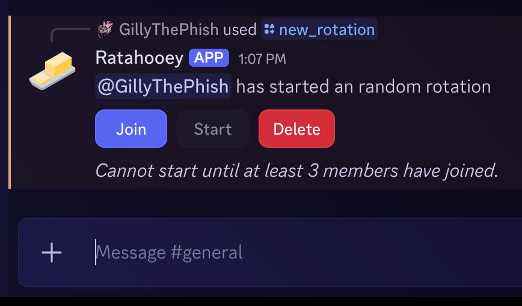
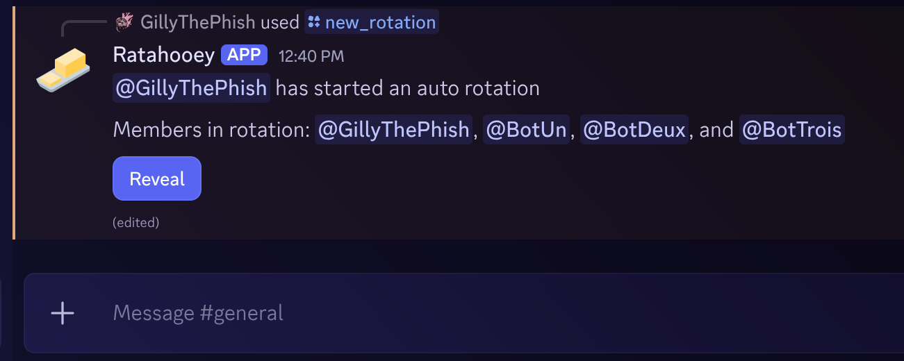
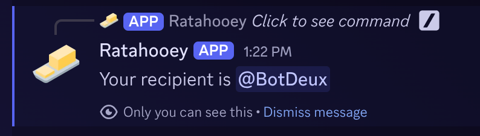
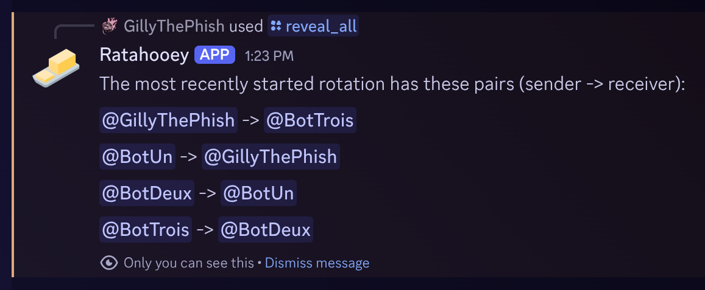

# Ratatooey

This is a simple bot for creating a Secret-Santa-style rotation in a Discord server. It has 3 modes:

- **Random**: Everyone who joins a rotation is given the name of another user, but does not know who anyone else has received. This is a fully random selection. The selections are guaranteed to contain a single loop. If you consider one sender's recipient, then that recipient's recipient, on and on, you will reach every member of the rotation before getting back to the first sender.
- **Manual**: Everyone sees all the names of people who have not been selected yet, and can choose one of them, but not themselves or someone who's already been selected. Again, they cannot see who anyone else has selected. **(NOT IMPLEMENTED YET)**
- ✨**Magic**✨: Similar to Random, but uses the past history of all members in the rotation to have the lowest rate of repeating sender-receiver pairs. For example, let's say you've been in several prior secret santas with 2 members: "Breebo Braggins" and "Gwanyalf the Gwuwu", and you've gotten Breebo as the recipient 3 times and never once gotten Gwanyalf. The Magic process will prefer to give you Gwanyalf over Breebo. However, it considers the best selection for ALL rotation members collectively, so it's still possible to get Breebo if for example Breebo has gotten you 5 times and Gwayyalf has gotten Breebo 8 times. Due to [technical limitations](#reason-for-magic-limitation), this selection process is limited to 8 members. Another difference from the Random selection is that Magic selections don't guarantee a single loop of receivers. This is intentional, since if we limit ourselves only to a single loop, we could be missing out of arrangements that are better for as many people as possible.

## Commands

### New Rotation

`/new_rotation Random|Manual|Magic`

This generates an open rotation on the channel, which will have 3 options (in this example, I used `/new_rotation Random`):


- `Join` - Join this rotation as a member (limited to 8 members for Magic rotations). Any member of the server can join.
- `Start` - This ends the pending status of the rotation, which effectively locks in the members. Either the Admin or the initiator of the rotation can start it.
- `Delete` - Delete the pending rotation. Either the Admin or the initiator of the rotation can start it.

If there is already a pending (unstarted) rotation on the server, this command will fail. The pending rotation will either need to be started or deleted first before a new one can be created.

#### Started Rotations

A rotation that has started will change to this form:


This has a `Reveal` action that, if used by a user in the rotation, will provide them with their recipient in an ephemeral message (can only be seen by them):


### Delete Rotation

`/delete_rotation`

Deletes the pending (unstarted) rotation if one exists on the server. Even though the rotation widget has a "Delete" button, this extra command is provided as a convenience.

Like with the message action, the delete command can only be run by an admin or the user that initiated the rotation.

### Show Rotation

`/show_rotation`

If there is a pending (unstarted) rotation on the server, there _should_ be a widget that allows it to be joined, started, or deleted. However, since this widget is a Discord message, it's possible to delete this message. To prevent a soft-lock of the bot state, this command will recreate the widget message in the server. If the original message hasn't been deleted, this command will delete it before recreating the new message.

This command can be run by any member.

### Reveal All

`/reveal_all`

Reveals the full list of sender/receiver pairs for the last started rotation. It does so in an ephemeral message (which can only be seen by the person who calls it).



This can only be run by an admin. If the initiator is not an admin, they will not be able to run this command.

## Installation

Before anything else, if you're running this bot as intended, you will need [`docker`](https://www.docker.com/) installed.

In order to set up the service, you need to [follow the steps](https://discord.com/developers/docs/quick-start/getting-started) to create a Discord bot. Once you have that, you need to provide some details in an `.env` file in the top level of this repository with these values:
```ENV
APP_ID=<value goes here>
DISCORD_TOKEN=<value goes here>
PUBLIC_KEY=<value goes here>
```

- The `APP_ID` is the `Application ID` found on the "General Information" tab of your [application page](https://discord.com/developers/applications) on the Discord Developer portal. The `PUBLIC_KEY` is also found on this page, conveniently titled "Public Key".
- The `DISCORD_TOKEN` is generated on the "Bot" tab of the application page. These tokens can only be viewed once the moment you create it, so you have to create (or reset it), then save it in the ENV file.

It's worth pointing out if you're not familiar with token-based authentication is:
- The `APP_ID` and the `PUBLIC_KEY` are not necessarily secrets. The `APP_ID` is needed to identify your bot, and the `PUBLIC_KEY` is meant to craft requests that can only be read by your bot.
- The `DISCORD_TOKEN` is a SECRET. If someone else has this, they can create a service that acts as your bot, which _n'est pas bon_.

This repository comes equiped with a Docker Compose configuration that runs an [ngrok](https://ngrok.com/) reverse proxy, which is fancy speak for _"a service that gives my locally hosted repository a URL that the Discord API can make requests to"_. The alternative is that I pay money to host the bot somewhere like Digital Ocean, and I didn't want to do that; The free tier of `ngrok` is more than good enough for my small use-case. If I were needing this bot to support many servers and handle a LOT of traffic, I would consider hosting my bot elsewhere.

If you want to use `ngrok` too, you will need to add these values to the `.env` file:
```ENV
NGROK_AUTHTOKEN=<value goes here>
NGROK_LISTEN_ADDR=http 9001
```

The `NGROK_AUTHTOKEN` comes from your `ngrok` [dashboard](https://dashboard.ngrok.com/get-started/your-authtoken) (it's free to make an account). The `NGROK_LISTEN_ADDR` value is hard set to the port of the bot service. If you change the port that the bot listens on, be sure to change this ENV variable (as well as the relevant configuration in the [docker compose file](./docker-compose.yaml)).

Once you have all that, you can run your bot with a few commands. First, you need to initialize the database. This bot saves its data in a SqliteDB, so you should have `sqlite3` installed. Then you can initialize the db with:
```bash
$ sqlite3 data/ratatooey.db < init-db.sql
```
Now that that's settled, the containers can be built and run:
```bash
$ docker compose build
$ docker compose up -d
```

On the Discord side, you will need to do 2 things:
### 1. Register the commands.

You will need `npm` installed, which will allow you to run this command:
```bash
$ npm run register
```
If you don't want to install `npm` on your host machine, you could also run it from the docker container, which already has `npm`:
```bash
# This puts you into a container running the bot service image.
docker run -it ratatooey-bot-ratatooey:latest bash

# This is run from the container
npm run register
```
### 2. Add the bot to the server of your choice.

This can be accomplished by:
1. Nagivating to the "Oauth" tab of the Discord application page for your bot
2. Scrolling to the "OAuth2 URL Generator"
3. Selecting the `applications.commands` and `bot` scopes
4. Selecting `Send Messages` under the bot permissions
5. Ensuring the Integration Type is "Guild Install"
6. Navigating to the URL in the "Generated URL" box (just copy and paste into your browser).

This will open Discord and let you select the Discord Server to add the bot to.

## Reason for Magic limitation:

The time-complexity of my implementation of the magic selection process is factorial because it considers all possible [derangements](https://en.wikipedia.org/wiki/Derangement) of the list of members, then finds the one with the lowest score. This score is a simple calculation of the sum of the occurances of all past sender-receiver pairs within a given selection. Since derangements grow factorially, this function gets very naughty _very quickly_. On my not-so-bad PC, this equates to a time of ~600ms for 10 members. I don't like that at all, so for the greatest chance of keeping things slim, I'm ensuring that no Magic rotation has more than 8 members.

The truth, however, is that I'm 100% positive that there's a better way to calculate the best selection without brute force, I just couldn't figure it out quickly enough and wanted to get this bot off the ground. Also, the server I want to use this in only has 7 members at the moment, so this definitely isn't an issue yet.

